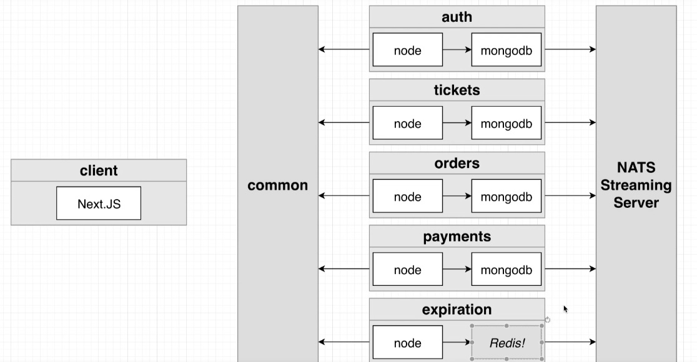

 
  

Javascript based microservices architecture for the creation of a platform for the purchase and creation of tickets.

### Services

- **Auth**: Everything related to user signup/ signin/ signout.
- **Tickets**: Ticket creation/ editing. Knows whether a ticket can be updated.
- **Orders**: Order creation/ editing.
- **Expiration**: Watches for orders to be created, cancels them after 1 minute.
- **Payments**: Handles credit card payments. Cancels orders if payments fails, completes if payment succeeds.

### Architecture

### Technologies

- React
- Next.js
- Node.js
- TypeScript
- NATS Streaming Server
- Jest and Supertest for testing purpose
- Skaffold 
- MongoDB
- Stripe to manage payments
- Redis
- npm
- Docker
- Kubernetes
- GitHub actions for CI/ CD

Credits to Stephen Grider for the amazing course on [microservices architecture](https://www.udemy.com/course/microservices-with-node-js-and-react/) with javascript hosted on Udemy.

